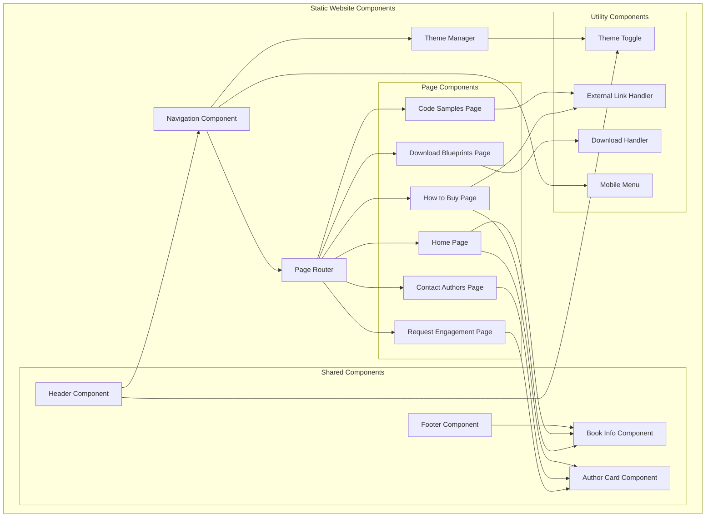

# Component Diagram: AI Ready Data Blueprints Website

## System Architecture Overview

## Component Responsibilities

### Core Navigation Components

#### Navigation Component
- **Purpose**: Main site navigation and routing
- **Responsibilities**:
  - Render navigation menu
  - Handle page transitions
  - Manage active page state
  - Coordinate with mobile menu

#### Theme Manager
- **Purpose**: Handle light/dark mode switching
- **Responsibilities**:
  - Manage theme state
  - Apply CSS custom properties
  - Persist user preference in localStorage
  - Coordinate theme changes across components

#### Page Router
- **Purpose**: Simple client-side routing for SPA behavior
- **Responsibilities**:
  - Handle URL changes
  - Show/hide page content
  - Update navigation state
  - Manage browser history

### Page Components

#### Home Page
- **Purpose**: Main landing page with book overview
- **Dependencies**: Book Info Component, Author Card Component
- **Responsibilities**:
  - Display hero section with book cover
  - Show book benefits and overview
  - Present author credentials
  - Provide call-to-action for purchase

#### How to Buy Page
- **Purpose**: Purchase options and retailer links
- **Dependencies**: Book Info Component, External Link Handler
- **Responsibilities**:
  - Display purchase options
  - Show pricing information
  - Handle external retailer links
  - Track purchase link clicks

#### Code Samples Page
- **Purpose**: GitHub repository access
- **Dependencies**: External Link Handler
- **Responsibilities**:
  - List available repositories
  - Provide repository descriptions
  - Handle GitHub links
  - Show usage instructions

#### Download Blueprints Page
- **Purpose**: PDF blueprint downloads
- **Dependencies**: Download Handler
- **Responsibilities**:
  - List available blueprints
  - Handle PDF downloads
  - Show file information
  - Track download events

#### Contact Authors Page
- **Purpose**: Author contact information
- **Dependencies**: Author Card Component, External Link Handler
- **Responsibilities**:
  - Display author contact details
  - Show social media links
  - Handle external profile links
  - Provide contact methods

#### Request Engagement Page
- **Purpose**: Service engagement information
- **Dependencies**: Author Card Component
- **Responsibilities**:
  - Display available services
  - Show engagement options
  - Provide contact information
  - Set service expectations

### Shared Components

#### Header Component
- **Purpose**: Site header with navigation and branding
- **Dependencies**: Navigation Component, Theme Toggle
- **Responsibilities**:
  - Display site branding
  - Render main navigation
  - Include theme toggle
  - Handle mobile menu trigger

#### Footer Component
- **Purpose**: Site footer with additional links
- **Dependencies**: Book Info Component
- **Responsibilities**:
  - Display copyright information
  - Show additional links
  - Include book publication details
  - Provide site map links

#### Book Info Component
- **Purpose**: Reusable book information display
- **Responsibilities**:
  - Show book title and subtitle
  - Display publication information
  - Render book cover image
  - Provide consistent book branding

#### Author Card Component
- **Purpose**: Reusable author information display
- **Responsibilities**:
  - Display author photo and credentials
  - Show contact information
  - Render social media links
  - Provide consistent author presentation

### Utility Components

#### Theme Toggle
- **Purpose**: Dark/light mode switch control
- **Dependencies**: Theme Manager
- **Responsibilities**:
  - Render toggle button
  - Handle user interactions
  - Communicate with Theme Manager
  - Show current theme state

#### Mobile Menu
- **Purpose**: Mobile-responsive navigation menu
- **Dependencies**: Navigation Component
- **Responsibilities**:
  - Render mobile menu overlay
  - Handle touch interactions
  - Manage menu open/close state
  - Provide mobile-friendly navigation

#### Download Handler
- **Purpose**: Manage file downloads
- **Responsibilities**:
  - Handle PDF download requests
  - Track download events
  - Manage download errors
  - Provide download feedback

#### External Link Handler
- **Purpose**: Manage external link behavior
- **Responsibilities**:
  - Open links in new tabs
  - Add security attributes
  - Track external link clicks
  - Handle link errors

## Data Flow

### Theme Management Flow
1. User clicks Theme Toggle
2. Theme Toggle notifies Theme Manager
3. Theme Manager updates CSS custom properties
4. Theme Manager saves preference to localStorage
5. All components reflect new theme

### Navigation Flow
1. User clicks navigation link
2. Navigation Component updates active state
3. Page Router shows/hides appropriate page content
4. Browser URL updates
5. Page-specific components initialize

### Download Flow
1. User clicks download link
2. Download Handler processes request
3. Browser initiates file download
4. Download Handler tracks event
5. User receives feedback